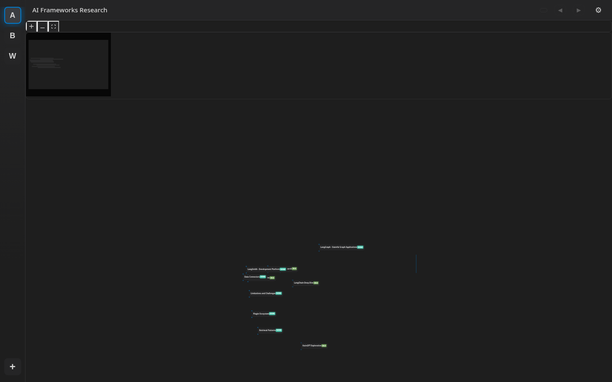
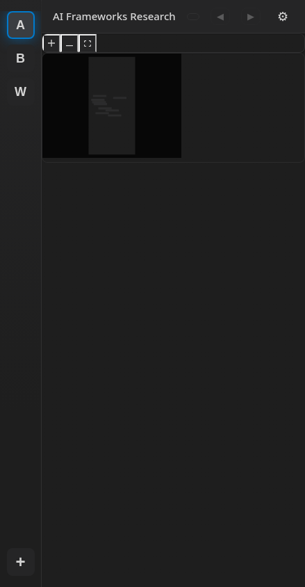
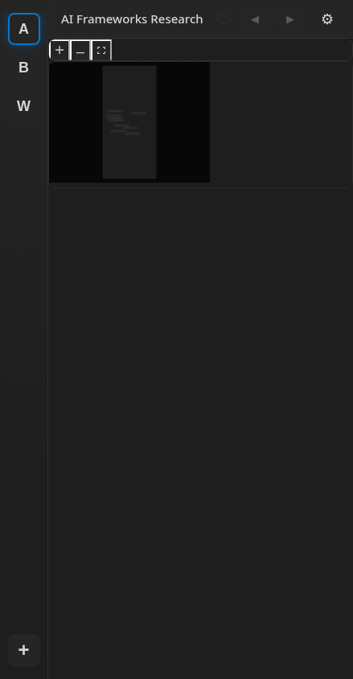

# UI Review — vision-critique-pass2

Date: 2026-08-30T02:44:16.872Z
Surface: production build (vite preview)
Round: 1

## Screenshots (absolute paths)

- `/home/jon/code/whitt/docs/ui-reviews/2026-08-30-vision-critique-pass2/01-picker-desktop.png`
- `/home/jon/code/whitt/docs/ui-reviews/2026-08-30-vision-critique-pass2/01-picker-mobile.png`
- `/home/jon/code/whitt/docs/ui-reviews/2026-08-30-vision-critique-pass2/02-graph-desktop.png`
- `/home/jon/code/whitt/docs/ui-reviews/2026-08-30-vision-critique-pass2/02-graph-mobile.png`
- `/home/jon/code/whitt/docs/ui-reviews/2026-08-30-vision-critique-pass2/03-node-focused-desktop.png`
- `/home/jon/code/whitt/docs/ui-reviews/2026-08-30-vision-critique-pass2/03-node-focused-mobile.png`

## Embedded

## Audit

- console error: NONE
- failed request: NONE
- unstyled input: NONE

## Verdict

demo-eligible: audit clean
