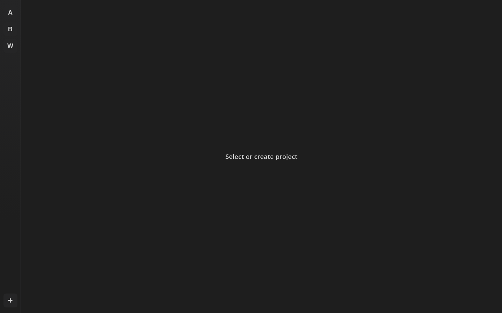
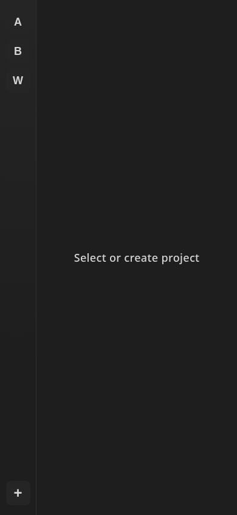
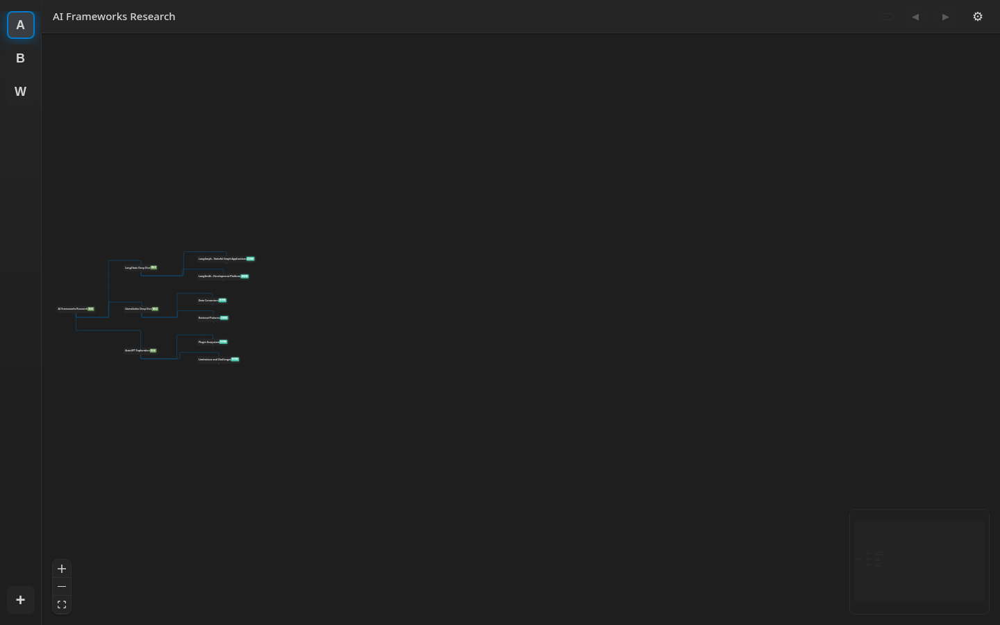
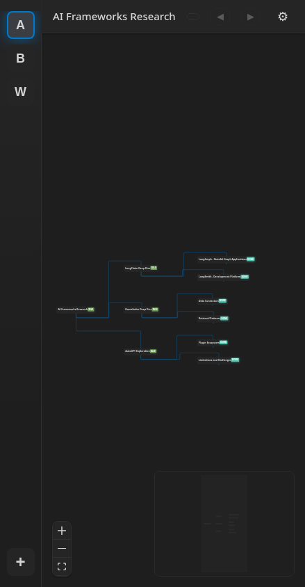
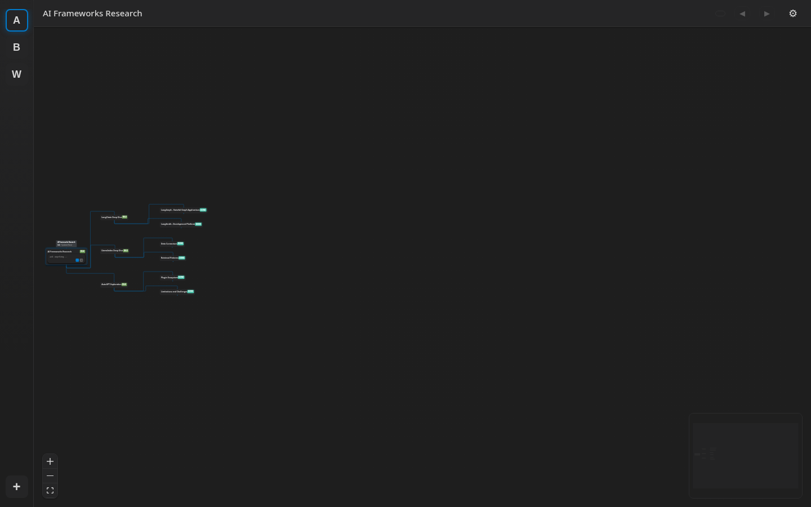
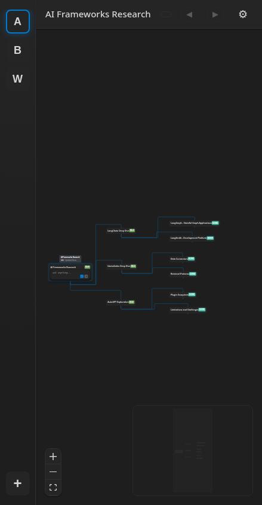

# UI Review — vision-critique-pass3

Date: 2026-08-30T03:14:14.782Z
Surface: production build (vite preview)
Round: 1

## Screenshots (absolute paths)

- `/home/jon/code/whitt/docs/ui-reviews/2026-08-30-vision-critique-pass3/01-picker-desktop.png`
- `/home/jon/code/whitt/docs/ui-reviews/2026-08-30-vision-critique-pass3/01-picker-mobile.png`
- `/home/jon/code/whitt/docs/ui-reviews/2026-08-30-vision-critique-pass3/02-graph-desktop.png`
- `/home/jon/code/whitt/docs/ui-reviews/2026-08-30-vision-critique-pass3/02-graph-mobile.png`
- `/home/jon/code/whitt/docs/ui-reviews/2026-08-30-vision-critique-pass3/03-node-focused-desktop.png`
- `/home/jon/code/whitt/docs/ui-reviews/2026-08-30-vision-critique-pass3/03-node-focused-mobile.png`

## Embedded

## Audit

- console error: NONE
- failed request: NONE
- unstyled input: 03-node-focused-desktop.png: textarea name=? bg=rgba(0, 0, 0, 0) border=0px none shadow=none
- unstyled input: 03-node-focused-mobile.png: textarea name=? bg=rgba(0, 0, 0, 0) border=0px none shadow=none

## Verdict

NOT demo-eligible: fix audit findings above
